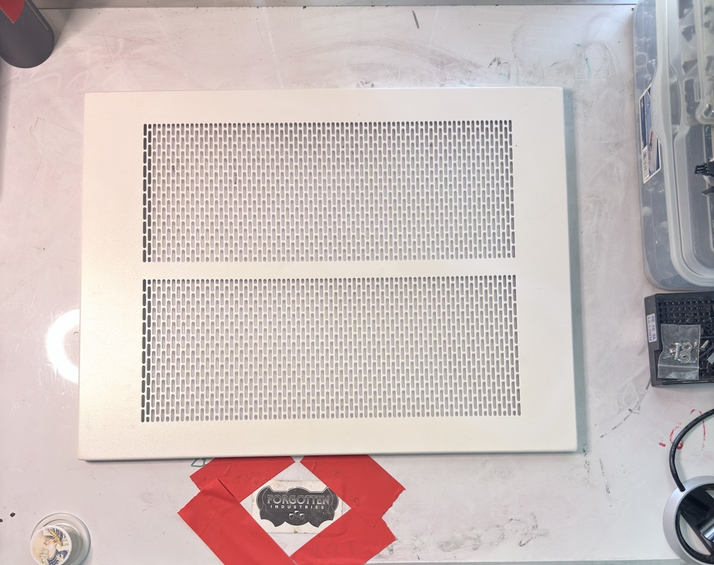

# Intake: CaseLabs Chassis Parts — 2026.06.20

## Session Summary

This intake covers 10 photographed CaseLabs chassis-related parts across 47 photos, including HDD storage assemblies, chassis plates, a radiator mounting plate, and a motherboard tray. This remains an intake record rather than a final identification list; the current labels reflect the best available user identifications, with official CaseLabs terminology and compatibility still subject to verification.

## Intake Rules

- Photograph before cleaning.
- Preserve as-found condition notes.
- Assign provisional IDs first.
- Do not force identification if uncertain.
- Distinguish panels from trays, cages, rails, brackets, and structural parts.
- Use photo references even before final filenames are normalized.
- Reconcile later against the Mercury S8 / pedestal build plan.

## Provisional ID System

Use `FI-CL-PART-001` through `FI-CL-PART-010` for this intake. These IDs are provisional and may later be renamed or cross-referenced once each part is positively identified.

## Known Starting Identifications

- Two groups are HDD storage assemblies: one 8-drive vibration-isolated mount assembly and one 120 mm flex-bay 4-drive cage.
- One group is identified as an STH10 EATX motherboard tray.
- The remaining groups are distinct top, front, rear, side, radiator-mounting, and bottom filler plates.
- Official names and chassis-family terminology still require comparison against dimensions, screw patterns, mounting interfaces, and CaseLabs documentation.

## Parts Intake Table

| ID             | Provisional Description                                                        | Part Type                         | Likely Assembly                                                      | Qty        | Material / Finish | Condition | Hardware Present                      | Photo Refs          | Confidence | Notes |
| -------------- | ------------------------------------------------------------------------------ | --------------------------------- | -------------------------------------------------------------------- | ---------- | ----------------- | --------- | ------------------------------------- | ------------------- | ---------- | ----- |
| FI-CL-PART-001 | 8× vibration-isolated 3.5-inch HDD mount assembly                               | HDD tray / drive mount assembly   | CaseLabs pedestal side-drive or pedestal storage bay assembly        | 1 assembly | unknown           | unknown   | unknown                               | PHOTO-001–PHOTO-005 | medium     | Large base plate with two 4× drive-bay sections. Intended for eight vibration-isolated mechanical 3.5-inch hard drives. This is the planned big pedestal storage plate / side-panel drive bay assembly. Exact official CaseLabs name still needs verification. |
| FI-CL-PART-002 | 120 mm flex-bay 4× HDD cage with fan                                            | drive cage / flex-bay accessory   | 120 mm flex-bay storage cage for front pedestal mounting             | 1          | unknown           | unknown   | Corsair static pressure fan; screws   | PHOTO-006–PHOTO-011 | medium     | This is the 120 flex-bay unit with 4× drive cage mounted behind it. Candidate for front-right pedestal storage position. Includes a Corsair static pressure fan. Two visible screws on one side are stripped/threaded in place and may require drilling out. |
| FI-CL-PART-003 | Mercury S8 / SMA top panel, ventilated both sides                              | top panel                         | main chassis top                                                     | 1          | unknown           | unknown   | unknown                               | PHOTO-012–PHOTO-017 | medium     | Appears to be the normal top panel for the body. Both sides are ventilated, consistent with use over drop-in radiator mounts. User referred to this as the “normal top” / “SA top of the body.” Verify exact Mercury S8/SMA terminology later. |
| FI-CL-PART-004 | Mercury S8 / SMA front plate with dual 120 mm fan cutouts                       | front plate                       | main chassis front                                                   | 1          | unknown           | unknown   | unknown                               | PHOTO-018–PHOTO-022 | medium     | Front plate with two 120 mm fan cutouts, flex-bay opening, and power-switch cutout. User identified this as a Mercury SA front plate. Verify exact chassis family terminology later. |
| FI-CL-PART-005 | Alternate Mercury S8 / SMA front plate with window opening                     | front plate                       | main chassis front                                                   | 1          | unknown           | unknown   | unknown                               | PHOTO-023–PHOTO-026 | medium     | Alternative front plate. Does not have the dual fan bays. Instead, the top-left area appears configured for a window insert/opening. Has the same flex-bay and power-switch configuration as FI-CL-PART-004. |
| FI-CL-PART-006 | Rear chassis plate with motherboard I/O, PSU, 120 mm, and 140 mm openings       | rear plate                        | main chassis rear                                                    | 1          | unknown           | unknown   | unknown                               | PHOTO-027–PHOTO-030 | medium     | Rear plate where motherboard I/O and expansion slots exit. Includes PSU cutout, 120 mm fan position at bottom, and 140 mm fan position at top. |
| FI-CL-PART-007 | Side plate for full window                                                     | side panel / window frame         | main chassis side                                                    | 1          | unknown           | unknown   | Window insert unknown or separate     | PHOTO-031–PHOTO-034 | medium     | Side plate/frame configured for a full window panel. Window insert itself may be separate or not shown. |
| FI-CL-PART-008 | 2×360 mm drop-in radiator top plate                                             | radiator top plate / mounting plate | main chassis top radiator system                                   | 1          | unknown           | unknown   | unknown                               | PHOTO-035–PHOTO-039 | medium     | Top plate configured for two 360 mm drop-in radiator mounts. Likely part of the CaseLabs top radiator mounting system. |
| FI-CL-PART-009 | Bottom center fill plate                                                       | bottom plate / filler plate       | lower chassis frame / floor insert                                   | 1          | unknown           | unknown   | unknown                               | PHOTO-040–PHOTO-043 | medium     | Bottom center fill plate that installs into a surrounding frame. Exact position and official name need verification. |
| FI-CL-PART-010 | EATX motherboard tray from STH10                                               | motherboard tray                  | STH10 / EATX tray and rail system                                    | 1          | unknown           | unknown   | unknown                               | PHOTO-044–PHOTO-047 | medium     | User identified this as the EATX motherboard tray from the STH10. Relevant to prior S8 rail/tray salvage discussion. Verify compatibility and mounting rail alignment during reconciliation. |

## Current Assembly Map

- PHOTO-001–005: 8× vibration-isolated 3.5-inch HDD mount assembly / pedestal storage plate.
- PHOTO-006–011: 120 mm flex-bay 4× HDD cage with Corsair static pressure fan; stripped screws require service.
- PHOTO-012–017: ventilated main chassis top panel.
- PHOTO-018–022: front plate with dual 120 mm fan openings, flex-bay opening, and power-switch cutout.
- PHOTO-023–026: alternate front plate with window opening, flex-bay opening, and power-switch cutout.
- PHOTO-027–030: rear plate with motherboard I/O, PSU, 120 mm, and 140 mm openings.
- PHOTO-031–034: side plate / frame for full window.
- PHOTO-035–039: 2×360 mm drop-in radiator top plate.
- PHOTO-040–043: bottom center fill plate.
- PHOTO-044–047: STH10 EATX motherboard tray.

## Representative Photographs

  <figure>
    
    <figcaption>FI-CL-PART-001 · PHOTO-003</figcaption>
  </figure>
  <figure>
    
    <figcaption>FI-CL-PART-002 · PHOTO-008</figcaption>
  </figure>
  <figure>
    
    <figcaption>FI-CL-PART-003 · PHOTO-012</figcaption>
  </figure>
  <figure>
    
    <figcaption>FI-CL-PART-004 · PHOTO-018</figcaption>
  </figure>
  <figure>
    
    <figcaption>FI-CL-PART-005 · PHOTO-024</figcaption>
  </figure>
  <figure>
    
    <figcaption>FI-CL-PART-006 · PHOTO-028</figcaption>
  </figure>
  <figure>
    
    <figcaption>FI-CL-PART-007 · PHOTO-031</figcaption>
  </figure>
  <figure>
    
    <figcaption>FI-CL-PART-008 · PHOTO-036</figcaption>
  </figure>
  <figure>
    
    <figcaption>FI-CL-PART-009 · PHOTO-040</figcaption>
  </figure>
  <figure>
    
    <figcaption>FI-CL-PART-010 · PHOTO-047</figcaption>
  </figure>

## Service Notes

- FI-CL-PART-002 has two stripped/threaded screws visible on one side.
- These screws may require drilling out.
- Do not attempt removal before additional close-up documentation.
- Preserve screw condition photos before service.

## Naming / Verification Needed

- [ ] Verify official CaseLabs name for the 8× vibration-isolated HDD mount assembly.
- [ ] Verify whether “Mercury S8,” “SMA,” or another CaseLabs subfamily name is correct for each front/top/rear plate.
- [ ] Verify whether FI-CL-PART-003 is the standard ventilated top panel or a radiator-top outer cover.
- [ ] Verify whether FI-CL-PART-008 is officially a drop-in radiator mount, top plate, or radiator tray.
- [ ] Verify STH10 EATX tray compatibility with the current S8 rail setup.
- [ ] Confirm whether the full-window side plate has its acrylic/window insert stored separately.

## Photo Batch Log

| Photo Ref           | Associated ID | View Type                | Shows                                                    | Notes |
| ------------------- | ------------- | ------------------------ | -------------------------------------------------------- | ----- |
| PHOTO-001–PHOTO-005 | FI-CL-PART-001 | overview/detail sequence | 8× vibration-isolated HDD mount assembly                 | Large pedestal storage plate with two 4× drive-bay sections. |
| PHOTO-006–PHOTO-011 | FI-CL-PART-002 | overview/detail sequence | 120 mm flex-bay 4× HDD cage with fan                     | Corsair static pressure fan; two stripped/threaded screws visible on one side. |
| PHOTO-012–PHOTO-017 | FI-CL-PART-003 | overview/detail sequence | Ventilated main chassis top panel                        | Both sides ventilated; exact S8/SMA terminology requires verification. |
| PHOTO-018–PHOTO-022 | FI-CL-PART-004 | overview/detail sequence | Front plate with dual 120 mm fan openings                | Includes flex-bay opening and power-switch cutout. |
| PHOTO-023–PHOTO-026 | FI-CL-PART-005 | overview/detail sequence | Alternate front plate with window opening                | Includes flex-bay opening and power-switch cutout. |
| PHOTO-027–PHOTO-030 | FI-CL-PART-006 | overview/detail sequence | Rear plate with motherboard I/O, PSU, and fan openings   | Includes 120 mm and 140 mm fan positions. |
| PHOTO-031–PHOTO-034 | FI-CL-PART-007 | overview/detail sequence | Side plate / frame for full window                       | Window insert may be separate or not shown. |
| PHOTO-035–PHOTO-039 | FI-CL-PART-008 | overview/detail sequence | 2×360 mm drop-in radiator top plate                      | Exact official part classification requires verification. |
| PHOTO-040–PHOTO-043 | FI-CL-PART-009 | overview/detail sequence | Bottom center fill plate                                 | Installs into a surrounding frame; exact position requires verification. |
| PHOTO-044–PHOTO-047 | FI-CL-PART-010 | overview/detail sequence | STH10 EATX motherboard tray                              | Compatibility and rail alignment require reconciliation. |

Suggested controlled view types: `overview`, `label/detail`, `corner`, `mounting holes`, `damage`, `hardware`, `edge/profile`, `comparison`, `tray detail`, `rail detail`, `screw pattern`, and `powder coat detail`.

## Condition Vocabulary

- clean
- dusty
- scratched
- chipped powder coat
- bent
- incomplete
- missing fasteners
- modified
- drilled
- corroded
- unknown

## Identification Checklist

- [ ] Separate true panels from trays, cages, brackets, rails, and structural pieces.
- [ ] Identify motherboard tray revision or compatible chassis if possible.
- [ ] Identify HDD tray or drive cage format.
- [ ] Determine whether each item belongs to the main S8 cube, pedestal, accessory system, or spare/salvage pile.
- [ ] Identify windowed vs solid panels where applicable.
- [ ] Note hinge/latch hardware where present.
- [ ] Note screw hole patterns.
- [ ] Note powder coat damage.
- [ ] Note any user modifications.
- [ ] Compare against existing build photos and CaseLabs documentation if available.
- [ ] Mark duplicates.
- [ ] Mark pieces needed for current build.
- [ ] Mark pieces that may be sold, archived, or stored.

## Reconciliation Notes

- Current S8 build:
- Pedestal:
- Motherboard tray / rail system:
- HDD cage / storage plan:
- STH10/EATX rail salvage pieces:
- Spare parts:
- Sell/archive pile:

## Open Questions

- [ ]
