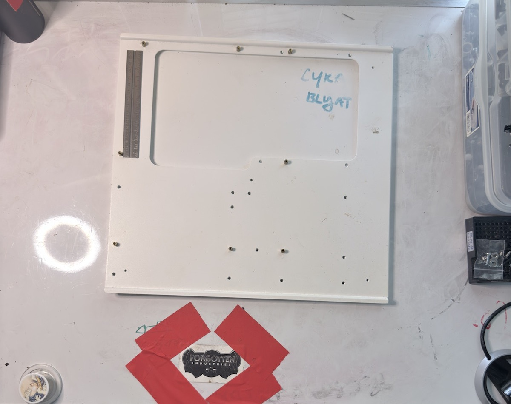

# STH10 EATX Motherboard Tray

## Object ID

`FI-CL-PART-010`

## Summary

This object is identified as an EATX motherboard tray from a CaseLabs STH10. It is relevant to the earlier S8 rail-and-tray salvage discussion because it may provide a usable tray or compatible mounting reference, although fit with the current S8 rail setup needs verification.

## Photographic Record

- PHOTO-044–PHOTO-047

Representative derivative from PHOTO-047 (`CASELABS_S8 - 47.HEIC`).

## Identification

- Provisional name: STH10 EATX motherboard tray
- Part type: motherboard tray
- Likely assembly: STH10 / EATX tray and rail system
- Quantity: 1
- Confidence: high
- Unverified naming questions: Verify the exact tray revision and compatibility with the current S8 rail system.

## Physical Description

EATX-format motherboard tray with motherboard mounting-hole patterns and formed tray features. The photographed structure includes the openings and mounting points relevant to board installation and alignment with a supporting rail system.

## Condition

Unknown.

## Hardware Present

TBD.

## Build Relevance

Potential salvage or adaptation candidate for the S8 motherboard tray / rail plan. Mounting rail alignment, chassis width, rear I/O relationship, and revision compatibility must be confirmed before use.

## Reconciliation

- [ ] Verify official CaseLabs part name.
- [ ] Verify chassis compatibility.
- [ ] Confirm orientation.
- [ ] Confirm whether related inserts, windows, trays, screws, or rails are stored separately.
- [ ] Decide keep / install / spare / sell / archive.

## Notes

Future updates:
