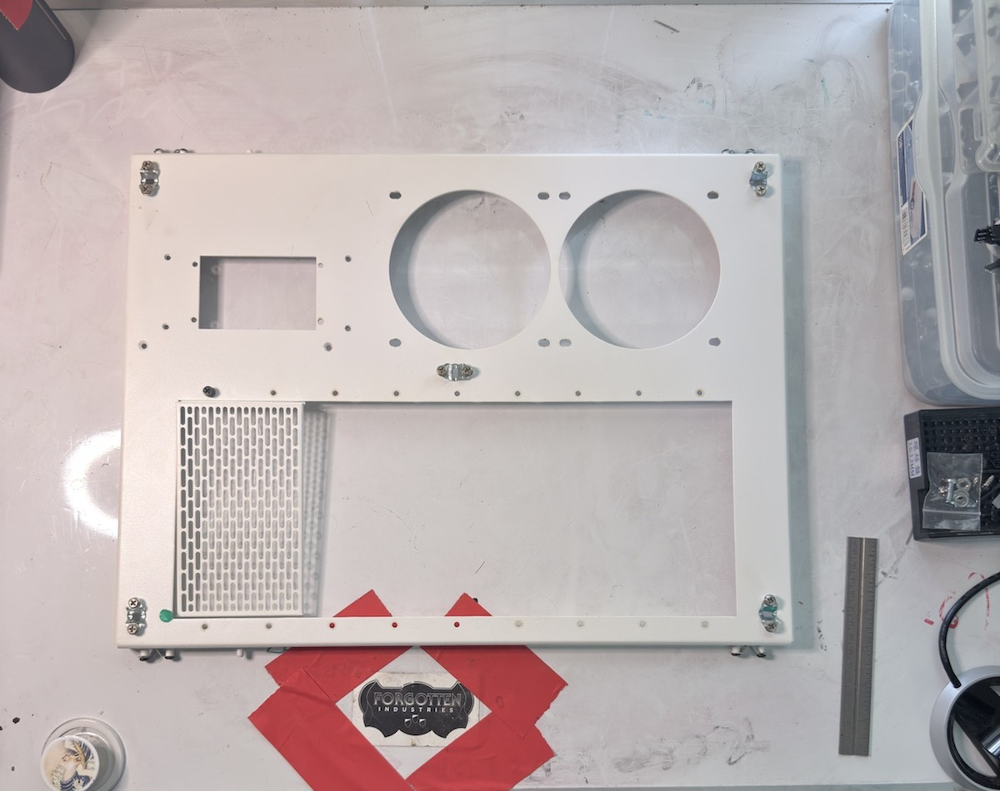

# Dual-120 Front Plate

## Object ID

`FI-CL-PART-004`

## Summary

This object appears to be a main-chassis front plate with two 120 mm fan openings, a flex-bay opening, and a power-switch cutout. It was identified by the user as a Mercury SA front plate and may provide the airflow-oriented front configuration for the S8 build. Exact chassis-family terminology needs verification.

## Photographic Record

- PHOTO-018–PHOTO-022

Representative derivative from PHOTO-018 (`CASELABS_S8 - 18.HEIC`).

## Identification

- Provisional name: dual-120 front plate
- Part type: front plate
- Likely assembly: main chassis front
- Quantity: 1
- Confidence: medium
- Unverified naming questions: Verify the official part name and whether Mercury S8, SMA, Mercury SA, or another CaseLabs designation applies.

## Physical Description

Front plate with two circular 120 mm fan cutouts, a flex-bay opening, and a separate power-switch cutout. Mounting holes are distributed around the openings and perimeter.

## Condition

Unknown.

## Hardware Present

TBD.

## Build Relevance

Provides a likely front-face option for the main chassis where dual 120 mm intake or exhaust positions are wanted alongside flex-bay access.

## Reconciliation

- [ ] Verify official CaseLabs part name.
- [ ] Verify chassis compatibility.
- [ ] Confirm orientation.
- [ ] Confirm whether related inserts, windows, trays, screws, or rails are stored separately.
- [ ] Decide keep / install / spare / sell / archive.

## Notes

Future updates:
