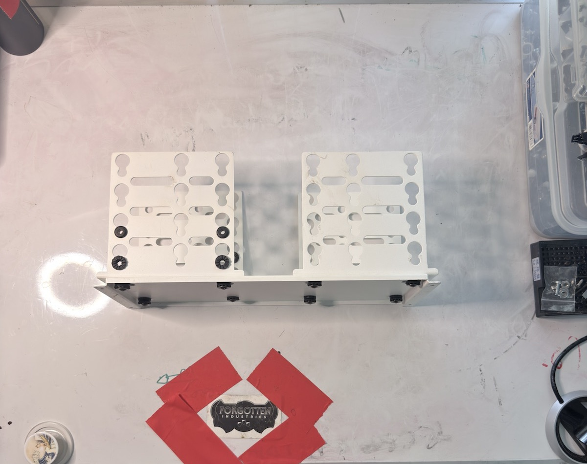
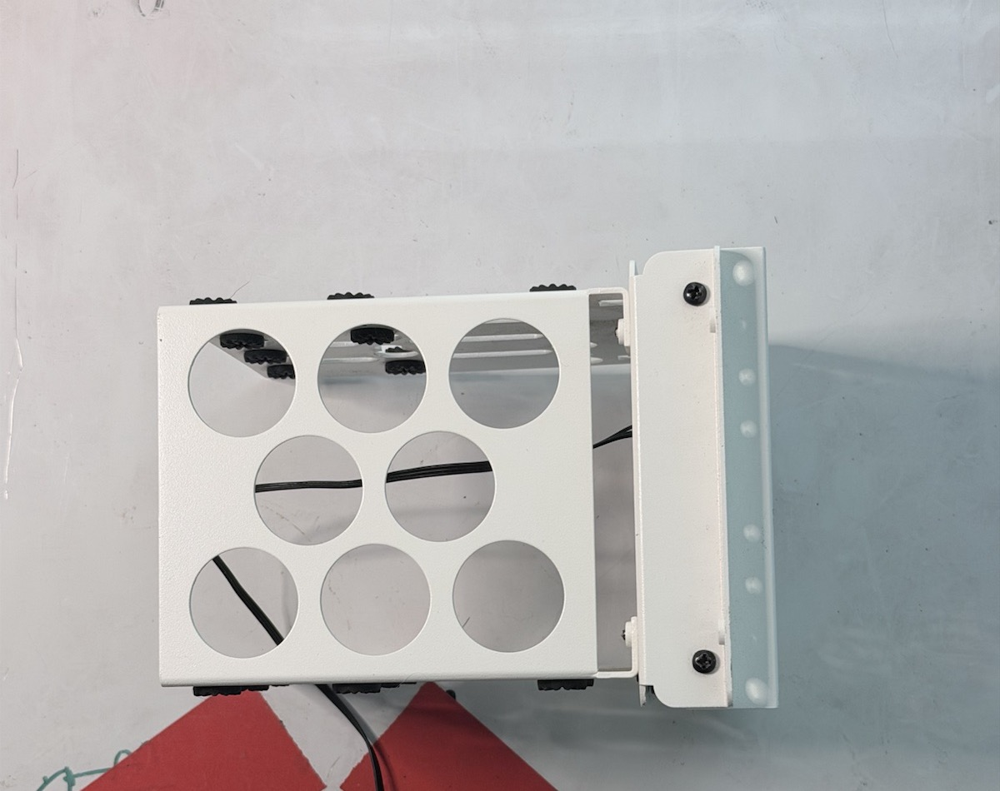
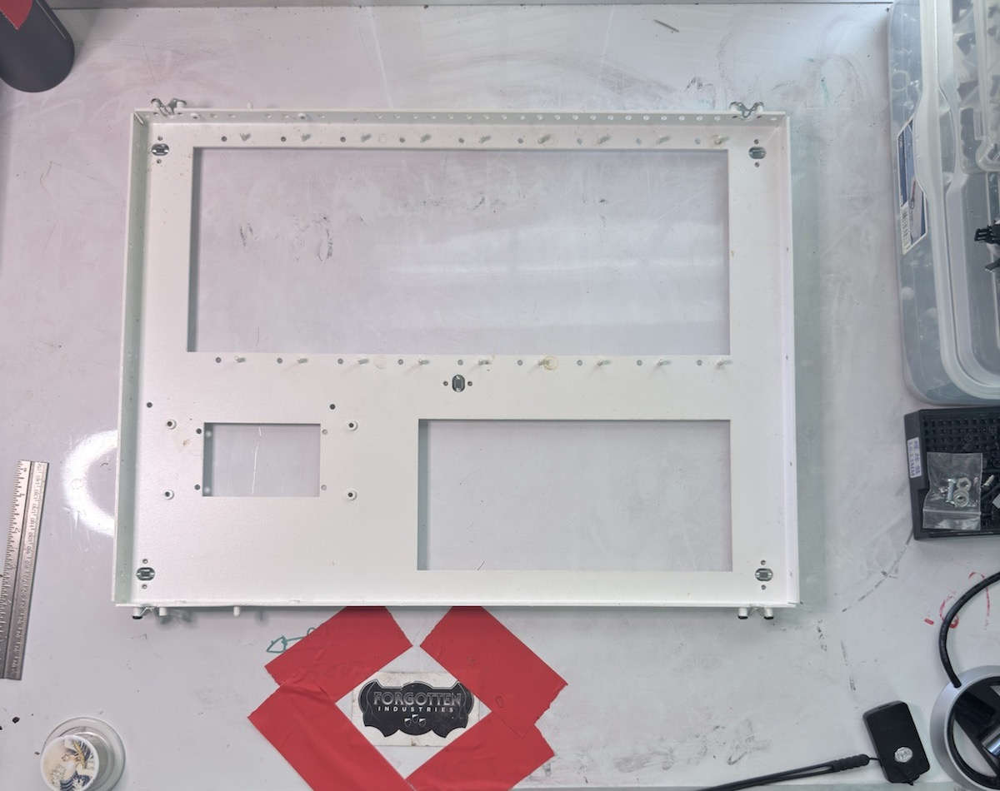
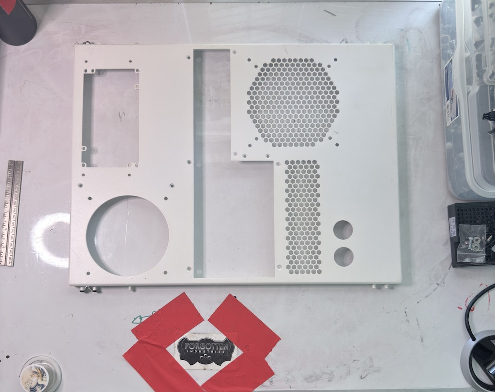
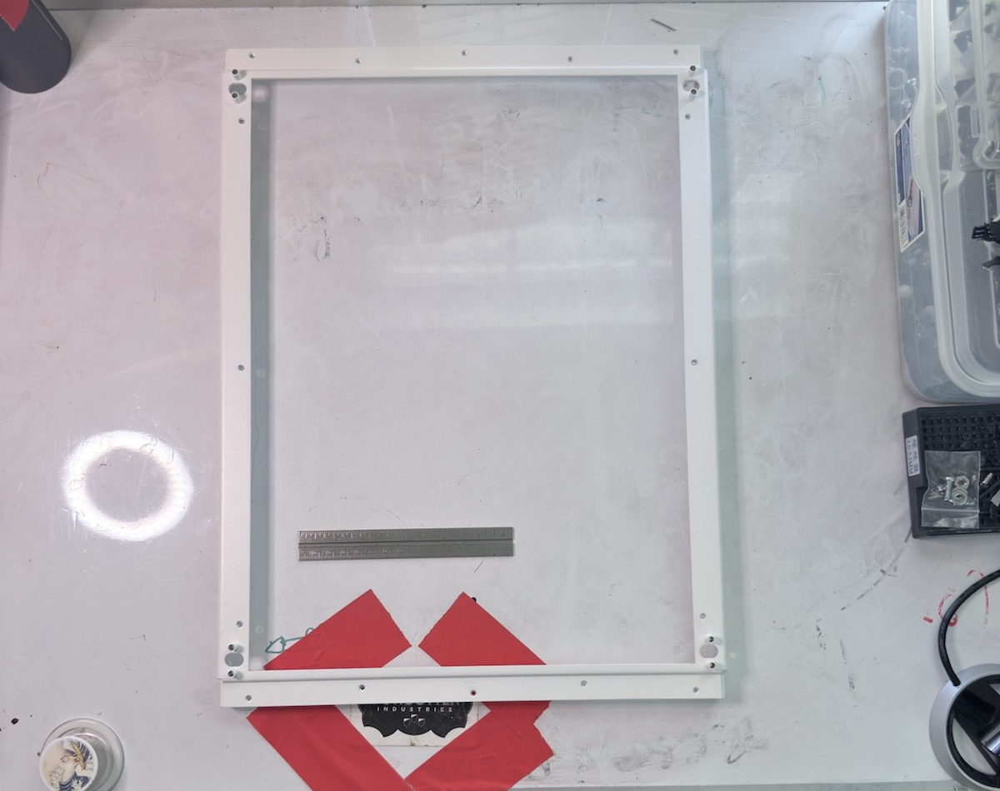
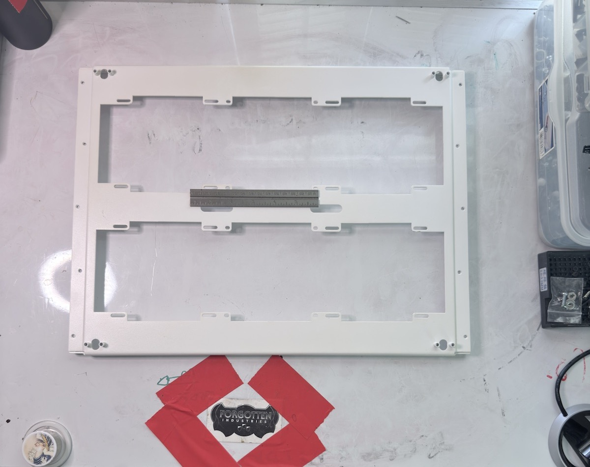
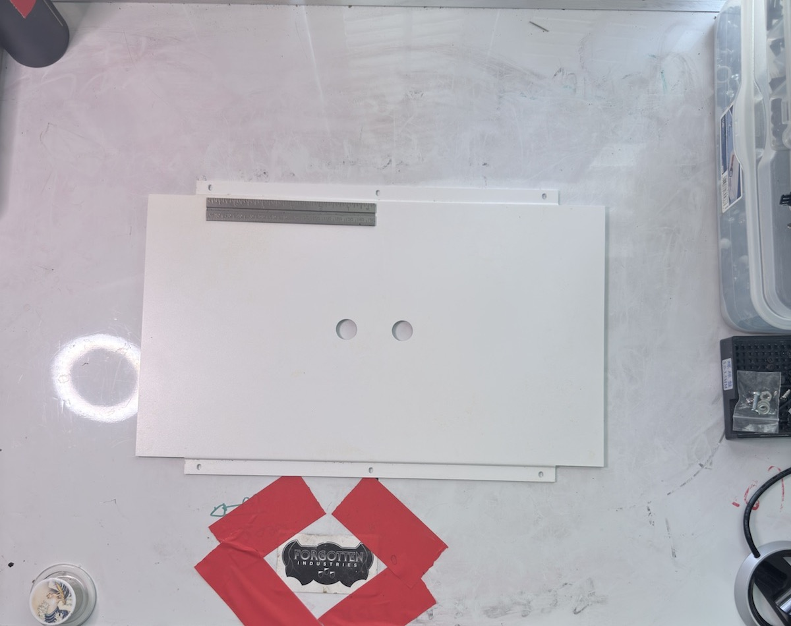

# L’Archive: CaseLabs Mercury S8 / Pedestal

## Collection Summary

This index tracks object-level records for CaseLabs Mercury S8 and related pedestal, storage, radiator, tray, and chassis components. Identifications remain provisional where official CaseLabs names or cross-chassis compatibility have not been verified.

## Object Records

| Object ID      | Object                                            | Type                                | Photo Range         | Status | Entry                                                 |
| -------------- | ------------------------------------------------- | ----------------------------------- | ------------------- | ------ | ----------------------------------------------------- |
| FI-CL-PART-001 | 8× Vibration-Isolated 3.5-inch HDD Pedestal Mount | HDD tray / drive mount assembly     | PHOTO-001–PHOTO-005 | intake | [Record](fi-cl-part-001-8x-hdd-pedestal-mount/)       |
| FI-CL-PART-002 | 120 mm Flex-Bay 4× HDD Cage with Fan              | drive cage / flex-bay accessory     | PHOTO-006–PHOTO-011 | intake | [Record](fi-cl-part-002-120-flex-bay-4x-hdd-cage/)    |
| FI-CL-PART-003 | Ventilated Main Chassis Top Panel                 | top panel                           | PHOTO-012–PHOTO-017 | intake | [Record](fi-cl-part-003-ventilated-top-panel/)        |
| FI-CL-PART-004 | Dual-120 Front Plate                              | front plate                         | PHOTO-018–PHOTO-022 | intake | [Record](fi-cl-part-004-dual-120-front-plate/)        |
| FI-CL-PART-005 | Window Front Plate                                | front plate                         | PHOTO-023–PHOTO-026 | intake | [Record](fi-cl-part-005-window-front-plate/)          |
| FI-CL-PART-006 | Rear I/O and PSU Plate                            | rear plate                          | PHOTO-027–PHOTO-030 | intake | [Record](fi-cl-part-006-rear-io-psu-plate/)           |
| FI-CL-PART-007 | Full-Window Side Frame                            | side panel / window frame           | PHOTO-031–PHOTO-034 | intake | [Record](fi-cl-part-007-full-window-side-frame/)      |
| FI-CL-PART-008 | Dual-360 Drop-In Radiator Top Mount               | radiator top plate / mounting plate | PHOTO-035–PHOTO-039 | intake | [Record](fi-cl-part-008-dual-360-radiator-top-mount/) |
| FI-CL-PART-009 | Bottom Center Filler Plate                        | bottom plate / filler plate         | PHOTO-040–PHOTO-043 | intake | [Record](fi-cl-part-009-bottom-center-filler-plate/)  |
| FI-CL-PART-010 | STH10 EATX Motherboard Tray                       | motherboard tray                    | PHOTO-044–PHOTO-047 | intake | [Record](fi-cl-part-010-sth10-eatx-motherboard-tray/) |

## Representative Photographs

  <figure>
    
    <figcaption>FI-CL-PART-001 · PHOTO-003</figcaption>
  </figure>
  <figure>
    
    <figcaption>FI-CL-PART-002 · PHOTO-008</figcaption>
  </figure>
  <figure>
    
    <figcaption>FI-CL-PART-003 · PHOTO-012</figcaption>
  </figure>
  <figure>
    
    <figcaption>FI-CL-PART-004 · PHOTO-018</figcaption>
  </figure>
  <figure>
    
    <figcaption>FI-CL-PART-005 · PHOTO-024</figcaption>
  </figure>
  <figure>
    
    <figcaption>FI-CL-PART-006 · PHOTO-028</figcaption>
  </figure>
  <figure>
    
    <figcaption>FI-CL-PART-007 · PHOTO-031</figcaption>
  </figure>
  <figure>
    
    <figcaption>FI-CL-PART-008 · PHOTO-036</figcaption>
  </figure>
  <figure>
    
    <figcaption>FI-CL-PART-009 · PHOTO-040</figcaption>
  </figure>
  <figure>
    
    <figcaption>FI-CL-PART-010 · PHOTO-047</figcaption>
  </figure>

## Intake Source

The [CaseLabs chassis-parts intake record](../../intake/l-archive/2026-06-20-caselabs-chassis-parts/) remains the batch-level evidence record for the photo session. The entries linked above are the corresponding object-level records.

## Reconciliation Priorities

- [ ] Confirm official CaseLabs names.
- [ ] Confirm Mercury S8 / SMA / STH10 compatibility terminology.
- [ ] Add real photo filenames once photo assets are normalized.
- [ ] Confirm which parts are needed for the active S8 build.
- [ ] Separate install parts, spare parts, sale parts, and historical archive parts.
- [ ] Document service work before modification.

## Notes

Future collection-level notes:
