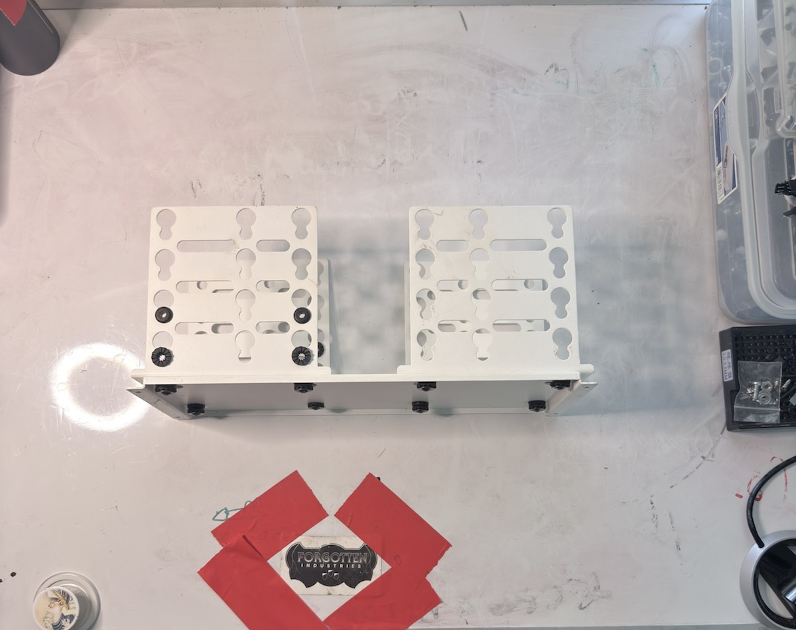
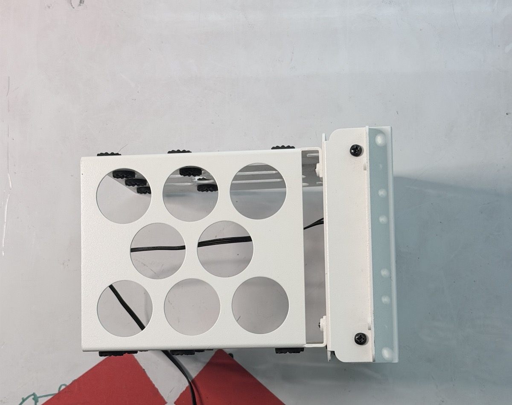
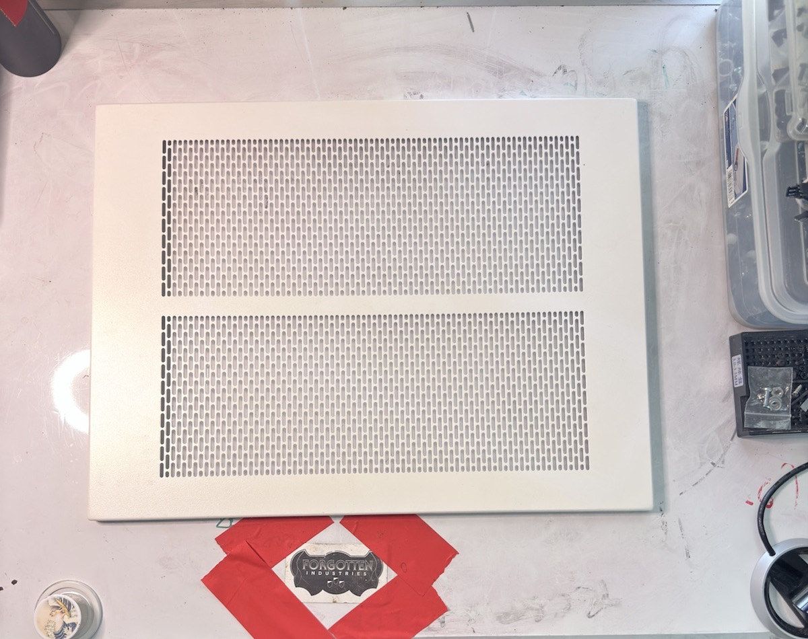
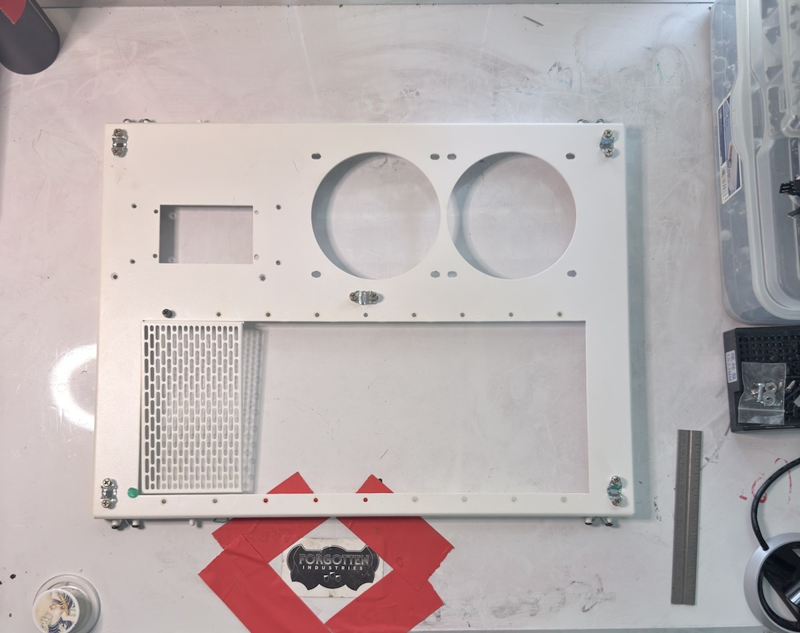
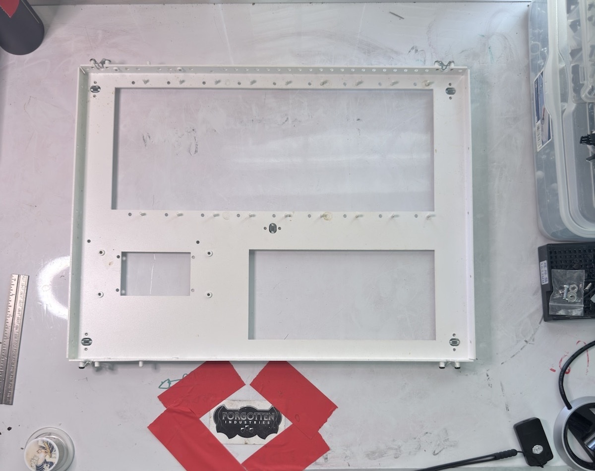
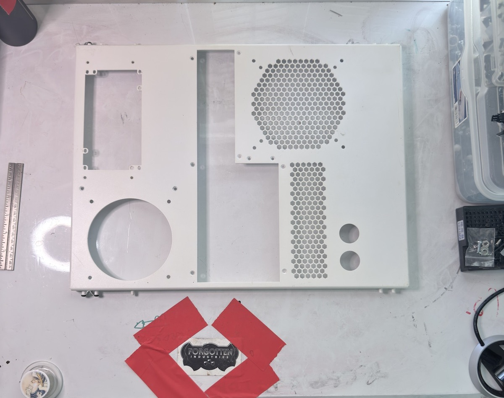
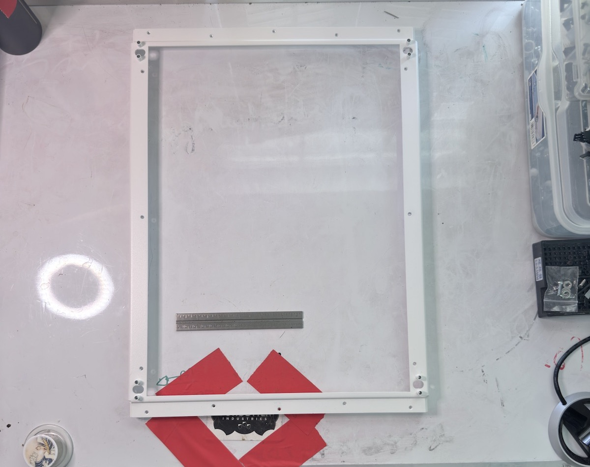
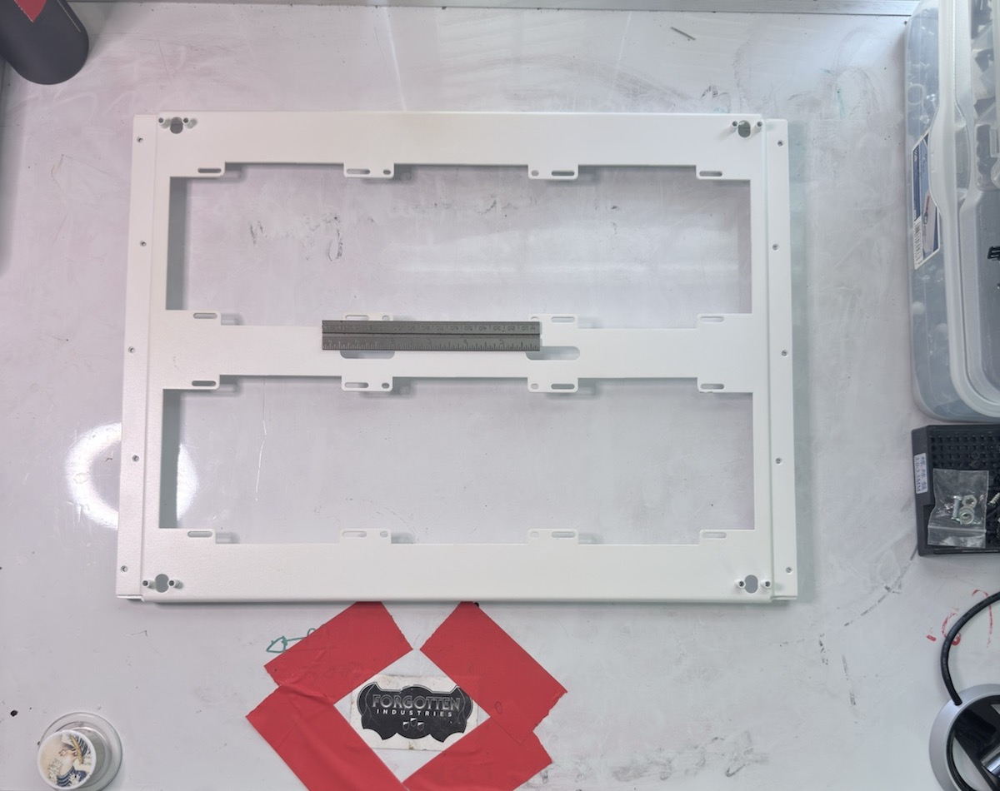
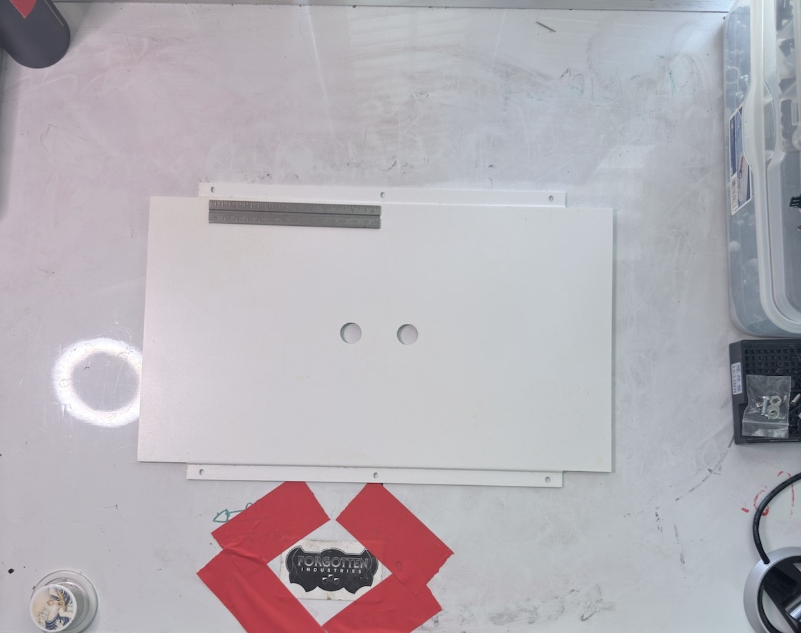
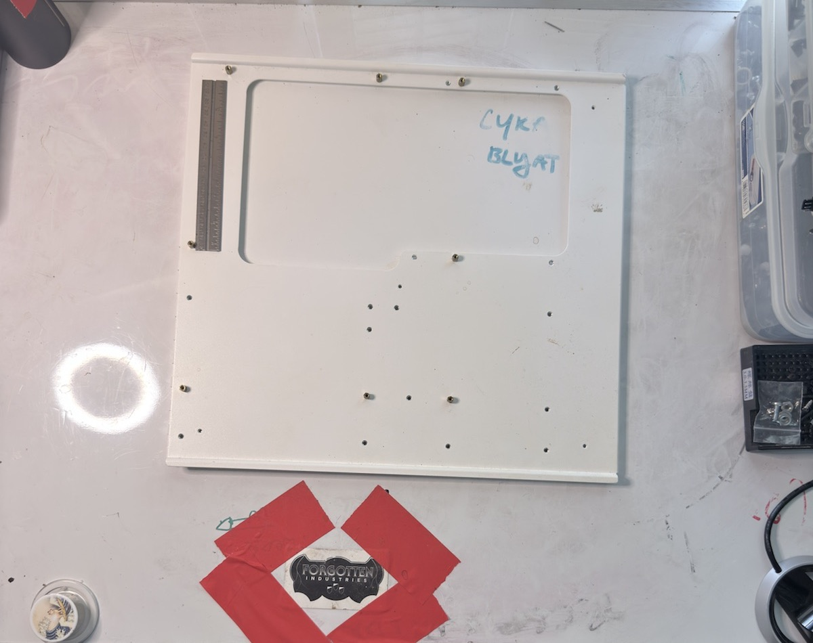

_L’Archive: CaseLabs Mercury S8 / Pedestal_

## What This Is

CaseLabs closed in 2018, and with it went the parts store, the support desk, and most of the documentation. This page is one Mercury S8 and its pedestal, taken apart and recorded part by part during restoration. Each part has its own photographed record.

Identifications are **provisional** unless marked otherwise. Official CaseLabs part names and cross-chassis compatibility have not been verified. Where we are unsure, the record says so.

## Parts

| ID | Part | What it does | ID confidence | Record |
| -- | ---- | ------------ | ------------- | ------ |
| FI-CL-PART-001 | 8× Vibration-Isolated 3.5-inch HDD Pedestal Mount | Base plate carrying two four-drive sections for eight 3.5-inch hard drives | medium | [Record](fi-cl-part-001-8x-hdd-pedestal-mount/) |
| FI-CL-PART-002 | 120 mm Flex-Bay 4× HDD Cage with Fan | Four-drive cage behind a 120 mm flex-bay face, with fan | high | [Record](fi-cl-part-002-120-flex-bay-4x-hdd-cage/) |
| FI-CL-PART-003 | Ventilated Main Chassis Top Panel | Main chassis top, vented above the radiator mounting area | medium | [Record](fi-cl-part-003-ventilated-top-panel/) |
| FI-CL-PART-004 | Dual-120 Front Plate | Front plate with two 120 mm fan cutouts, flex-bay opening, and power-switch cutout | medium | [Record](fi-cl-part-004-dual-120-front-plate/) |
| FI-CL-PART-005 | Window Front Plate | Front plate with a window opening in place of the fan cutouts | medium | [Record](fi-cl-part-005-window-front-plate/) |
| FI-CL-PART-006 | Rear I/O and PSU Plate | Rear plate: motherboard I/O, expansion slots, PSU cutout, 120 mm and 140 mm fan positions | high | [Record](fi-cl-part-006-rear-io-psu-plate/) |
| FI-CL-PART-007 | Full-Window Side Frame | Side frame around a large opening for a full window insert | medium | [Record](fi-cl-part-007-full-window-side-frame/) |
| FI-CL-PART-008 | Dual-360 Drop-In Radiator Top Mount | Top plate locating two 360 mm radiators | medium | [Record](fi-cl-part-008-dual-360-radiator-top-mount/) |
| FI-CL-PART-009 | Bottom Center Filler Plate | Mostly solid insert for the lower frame | medium-low | [Record](fi-cl-part-009-bottom-center-filler-plate/) |
| FI-CL-PART-010 | STH10 EATX Motherboard Tray | EATX motherboard tray for the rail system | high | [Record](fi-cl-part-010-sth10-eatx-motherboard-tray/) |

## Representative Photographs

  <figure>
    
    <figcaption>FI-CL-PART-001 · PHOTO-003</figcaption>
  </figure>
  <figure>
    
    <figcaption>FI-CL-PART-002 · PHOTO-008</figcaption>
  </figure>
  <figure>
    
    <figcaption>FI-CL-PART-003 · PHOTO-012</figcaption>
  </figure>
  <figure>
    
    <figcaption>FI-CL-PART-004 · PHOTO-018</figcaption>
  </figure>
  <figure>
    
    <figcaption>FI-CL-PART-005 · PHOTO-024</figcaption>
  </figure>
  <figure>
    
    <figcaption>FI-CL-PART-006 · PHOTO-028</figcaption>
  </figure>
  <figure>
    
    <figcaption>FI-CL-PART-007 · PHOTO-031</figcaption>
  </figure>
  <figure>
    
    <figcaption>FI-CL-PART-008 · PHOTO-036</figcaption>
  </figure>
  <figure>
    
    <figcaption>FI-CL-PART-009 · PHOTO-040</figcaption>
  </figure>
  <figure>
    
    <figcaption>FI-CL-PART-010 · PHOTO-047</figcaption>
  </figure>

## Manual and Assembly Reference

- [CaseLabs Mercury S8 Manual 001 (PDF)](/assets/reference/hang-on-to-each-other/caselabs-mercury-s8/CaseLabs_Mercury_S8_Manual_001_ForgottenIndustries.pdf). Recovered Forgotten Industries manual export.
- [Mercury S8 assembly timelapse](/hang-on-to-each-other/). Case construction timelapse by cpachris at OCN, as embedded in the [XtremeRigs Mercury S8 review](https://www.xtremerigs.net/2014/04/04/caselabs-mercury-s8/) (2014). Third-party reference, not Forgotten Industries photography.

## Restoration Log

- [CaseLabs Mercury S8 restoration dossier](/projects/caselabs-mercury-s8/). The principal project page: main cube, pedestal, casters, storage chamber, and power foundation.
- [Rebuilding and archiving a CaseLabs Mercury S8 time capsule](/atlas/rebuilding-and-archiving-a-caselabs-mercury-s8-time-capsule/). ATLAS report.
- [The pedestal is the machine room](/posts/2026-07-15-the-pedestal-is-the-machine-room.html). Post.

## Fitment Notes

- The flex-bay cage (FI-CL-PART-002) and both front plates (FI-CL-PART-004, -005) share the flex-bay opening and power-switch cutout layout.
- The motherboard tray (FI-CL-PART-010) is identified as STH10 EATX. Its exact revision and fit with the current S8 rail system are unverified.
- EK sold a [D360-X2 kit marketed as a Mercury S8 drop-in](https://www.ekwb.com/shop/ek-kit-d360-x2-caselabs-mercury-s8-drop-in). Its fit with the top mount recorded here (FI-CL-PART-008) has not been tested.

## Open Questions

If you own or owned a CaseLabs case, you may know what we don't. We are looking for:

- Official CaseLabs names for any part above.
- Which parts are shared across the Mercury S8, SMA8, STH10, and other CaseLabs families.
- Whether FI-CL-PART-009 is a standard filler or a configuration-specific insert.

Corrections are credited in the next field log. [Contact Forgotten Industries](/contact.html).

## Intake Source

The [CaseLabs chassis-parts intake record](../../intake/l-archive/2026-06-20-caselabs-chassis-parts/) remains the batch-level evidence record for the photo session. The entries linked above are the corresponding object-level records.

## Reconciliation Priorities

- [ ] Confirm official CaseLabs names.
- [ ] Confirm Mercury S8 / SMA / STH10 compatibility terminology.
- [ ] Add real photo filenames once photo assets are normalized.
- [ ] Confirm which parts are needed for the active S8 build.
- [ ] Separate install parts, spare parts, sale parts, and historical archive parts.
- [ ] Document service work before modification.

## Notes

Future collection-level notes:
