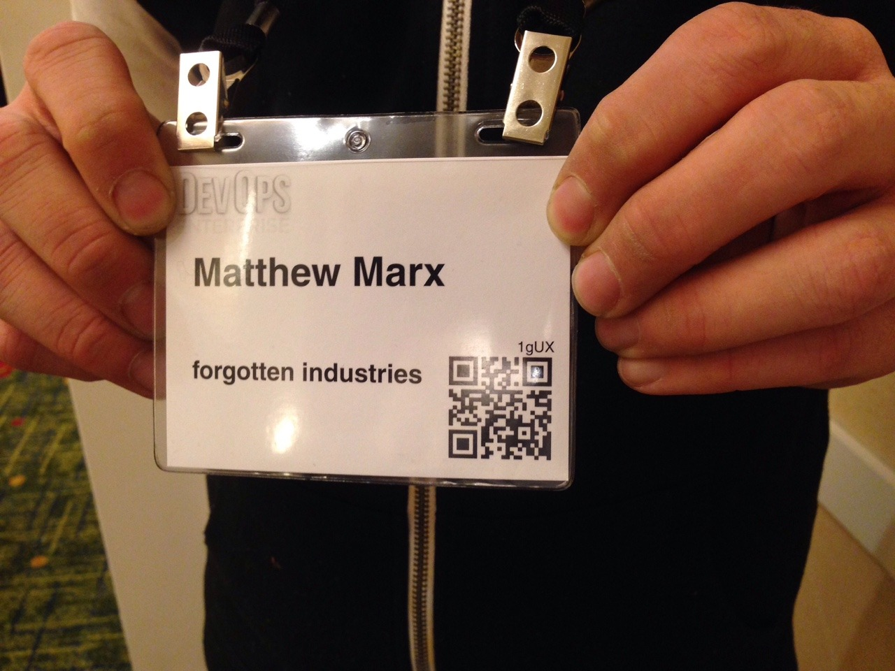
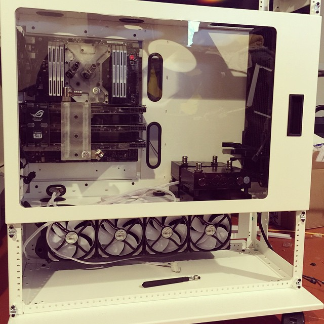
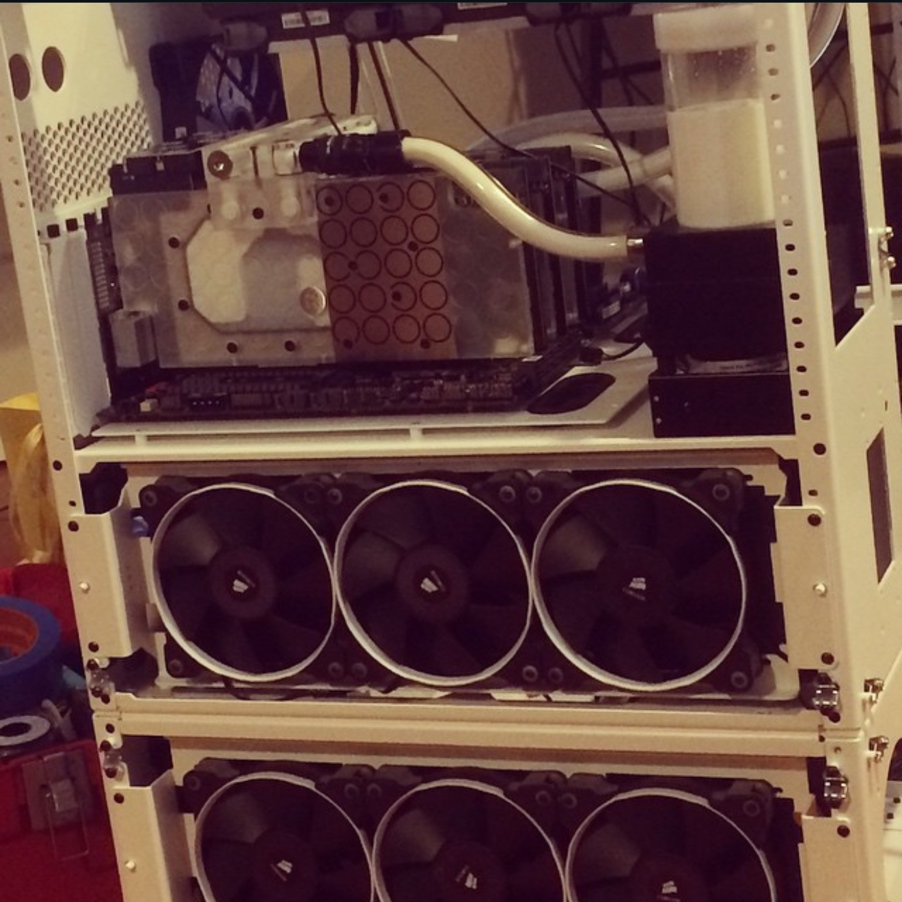
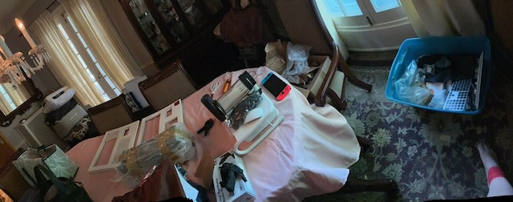
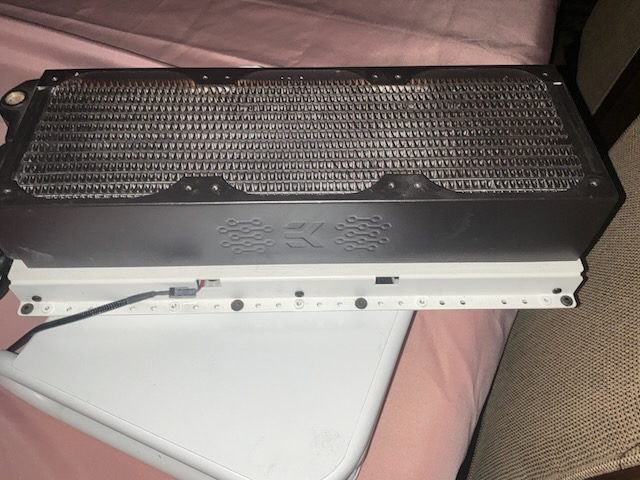

# Prelude: A Thing Documented Is a Thing Not Yet Lost

<<<<<<<< HEAD:src/posts/2026-06-06-perspective-peregrines-and-pang.md
_Forgotten Industries // Perspective, Peregrines, & “Pang” // Prelude // Entry 000 // 2026.06.06_
========
_Forgotten Industries // Signal Check // Prelude // Entry 000 // 2026.06.06_

> > > > > > > > origin/main:src/posts/2026-06-06-prelude-a-thing-documented-is-a-thing-not-yet-lost.md

_Reader note: death, substance use, recovery, and grief._

> A thing documented is a thing not yet lost.
> The archive remembers what panic forgets.
> Old systems do not wake by force. They wake by sequence.

## 00. Signal Check

_Ground yourself. Tell the truth. Dare to be brave enough to look directly at what survived._

Always tell the truth and you shall be untouchable.

That has been my modus operandi throughout my return to higher education. In 2020, near the end of the first brutal wave of the COVID-19 pandemic, I was just about to turn thirty years old. I had been less than a year sober from alcohol following my penultimate rock bottom, the make-or-break decision arc.

2014 to 2018, maybe 2019, is mostly unknown to me. And, to be clear, my personal story of recovery is not the focus of this archive. It is necessary background for what comes next.

> What happens to the things we have left behind?
> Is anything ever truly lost?
> What remains, and what will be left of them?

This is not the first true entry. This is the prelude: the signal check before the archive starts numbering itself.

_Early public evidence: Matthew Marx, Forgotten Industries, October 2014._

Forgotten Industries is the collective body of my work. My name is Matthew T. Marx. I established it in 2014 after the unexpected death of my father, Eric Hugh Marx, on January 10, 2014. My grandmother, Marjorie Marx, passed away weeks later in that frigid spring.

My father had nothing. He lived with substance use disorder, alcoholism specifically, and was eventually diagnosed with Wernicke-Korsakoff syndrome. That condition contributed to the opiate overdose that is presumed to be his cause of death. My grandparents' estate leapfrogged my dead dad, and I found myself sitting on half a million dollars in my early twenties.

Have you ever blacked out from overconsumption?

That is the best way I can explain what happened to me next. Except I did not lose a night. I lost four years.

I dissociated fully into booze and fucking watercooling. I probably spent fifty thousand dollars of my inheritance on hardware, fittings, blocks, pumps, cases, radiators, fans, and systems I never used. Some of it became work. Some of it became evidence. A lot of it became unopened boxes and machines waiting in storage for a version of me who did not know how to come back yet.

_What survives the shelf can survive the rebuild._

_CaseLabs evidence, November 2014. Watercooling was not a metaphor. It was where the money went._

_Recovered social-media crop: the old loop, the old excess, the old proof._

After a thirty-day inpatient program, I found myself through and out the other side of my disease. It has been years since I have had a drink. I do not keep track.

This is a blanket note of gratitude, not a credits roll. There are people whose support, love, guidance, connections, patience, and plain human steadiness helped me survive that era and move through recovery when I was still learning what recovery meant for me. I am not naming everyone yet. Names deserve care.

My mom, who is literally an angel, is the exception. Years later, when the route narrowed, she helped give me a safe and compatible place to finish the undergraduate degree I never got.

So. COVID-19. Yeah.

I was working at a methadone and Suboxone treatment center for people with opiate use disorder in Chicagoland, through recovery-community connections and my own new interest in the subject, having very recently begun to understand my own.

COVID again. Two of the three counselors I worked with died.

I lost my job.

I returned to Starbucks as a Plan D fallback. I made coffee part time for the next four years, transferred stores, and moved in with my mom and stepdad in Wichita, Kansas, away from every friend and thing I had ever known, so I could have a safe and compatible environment to finish the undergraduate degree I never got.

May 2024. I graduated from ASU with a B.S. in Biological Sciences, biomedical concentration. I had a minor in Philosophy with a focus on medical ethics. I graduated Cum Laude at the age of thirty-four. I walked the stage in Arizona with my mother present. She asked. I was happy to oblige, this time around.

I decided before the degree choice that if I was going to try to go back to school, holy shit, almost thirty and nothing to show, I might as well shoot as high as possible. I did not know what else to do, still so young out of recovery. I only knew I wanted to be better than I was.

I have always been smart, but I had nothing to show for it yet. I thrived under pressure.

Doctor?

Can I be a fucking doctor?

Turns out, yes. Yes, I could. I was accepted to the University of Kansas School of Medicine MD program, class of 2029, at the age of thirty-four. Holy shit. My class was mostly twenty-two-year-olds.

_Recovery is not lightning. It is voltage held steady._

_2026 intake: the machines did not disappear. They waited long enough to become evidence._

_Recovered hardware, before cleaning. The archive begins before the object gets improved._

What came then?

Perspective.

Peregrine.

And Pang.

Those are not the whole story of the prelude. They are the doorway out of it.

_PEREGRINE enters as field system, aircraft record, crash log, loss record, and boundary marker._

This archive does not begin with a clean heroic arc. It begins with the pang: the sharp, specific feeling of finding the machines again and realizing the things I abandoned were still there. They remembered more honestly than I could. They waited without forgiving or accusing. They simply remained.

The mark for pang is ∴ .

Read it as: therefore, now look.

Definition: a pang is the physical hit of recognition that arrives when an abandoned object becomes evidence again. It is not nostalgia. It is not proof by itself. It is the signal that something in the archive deserves to be stopped over, photographed, named, and handled with care.

Tutorial:

1. When the pang hits, stop moving.
2. Photograph the object before cleaning, sorting, selling, repairing, or explaining it.
3. Write the object name if you know it. If not, write what is visible.
4. Record the date, place, condition, and what the object made you remember.
5. Separate evidence from interpretation.
6. Then continue.

If Potato, my Shiba Inu, wanders into the frame, Potato stays in the record. He is not a random pet reference. He is lab partner, shop supervisor, sleep compliance officer, and living continuity proof. Companions are part of the evidence too.

Line open. Signal clean. What are we untangling?

That is the state of the archive now: not solved, not healed, not perfectly ordered, but reachable.

So the work now is simple.

Photograph before cleaning. Tell the truth before interpretation. Preserve the dump before curation. Publish one post at a time.

No map is built from motion alone. Stop, mark, continue.

What came next requires its own field doctrine.

Perspective changes the view. Peregrine gives the archive an eye above the hill. Pang teaches the body when an object has become evidence again.

The line is open. Signal clean. Entry 001 begins with the view.

-- Forgotten Industries // Prelude // Entry 000 // 2026.06.06
