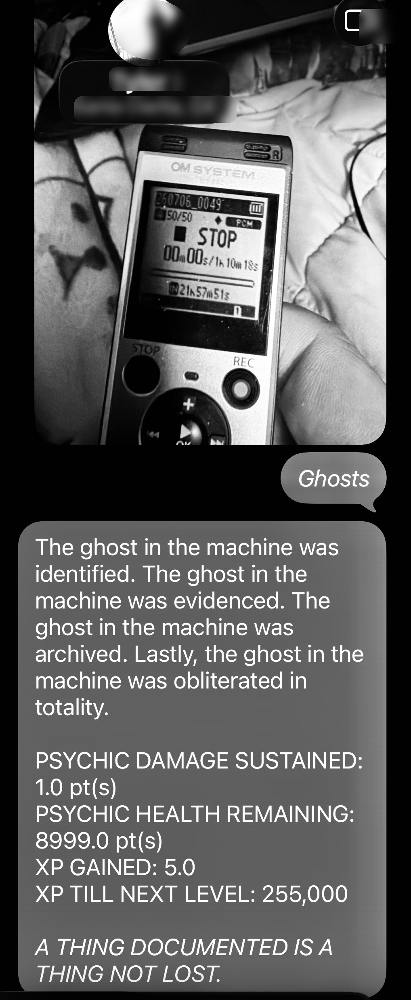

_Forgotten Industries // Le Signal // PREVIEW // 003 - L'INCIDENT_

## 00. Evidence Plate

## 01. Source Note

Source file: `IMG_2919.jpg`  
Operator label: "The incident."  
Screenshot metadata: `2026:07:06 17:18:20`

The image preserves a message exchange, a portable recorder display, and a rendered incident summary. Contact and location interface elements have been tightly redacted in the public preview image.

## 02. Observed Text

> The ghost in the machine was identified. The ghost in the machine was evidenced. The ghost in the machine was archived. Lastly, the ghost in the machine was obliterated in totality.
>
> PSYCHIC DAMAGE SUSTAINED: 1.0 pt(s)  
> PSYCHIC HEALTH REMAINING: 8999.0 pt(s)  
> XP GAINED: 5.0  
> XP TILL NEXT LEVEL: 255,000
>
> A THING DOCUMENTED IS A THING NOT LOST.

## 03. Archive Handling

This is not yet an object record.

It is a Signal specimen: the spark captured before explanation. The incident enters the archive as an observed exchange and evidence plate, with interpretation deferred until the operator authorizes a larger record.
