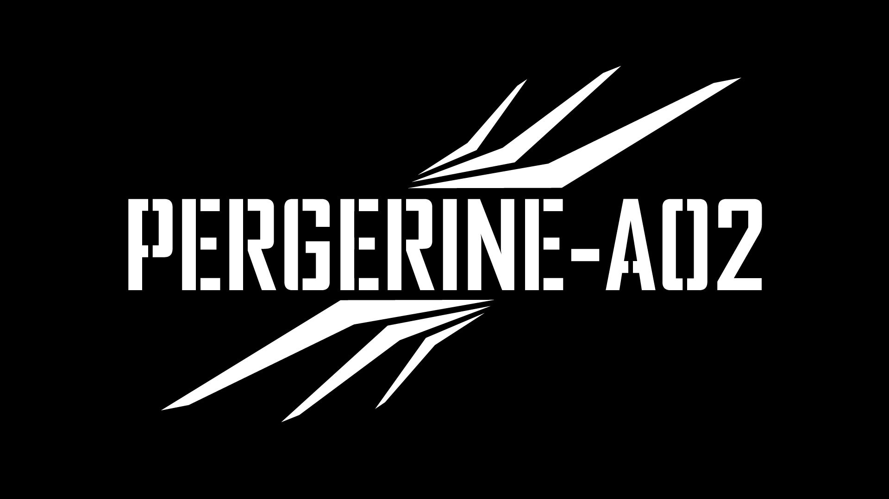

# Forgotten Industries UAV Division: The PEREGRINE Drone Experiments

PEREGRINE is the experimental flight program of the Forgotten Industries UAV
Division. It is the operational branch beneath Provenance From On High: the
aircraft, flight, crash, recovery, maintenance, and source-image record through
which aerial observation becomes archival practice.

> PATIENCE AS TEMPORAL PERSPECTIVE // ALTITUDE IN FLIGHT AS VERTICAL PERSPECTIVE

`ON THE FIVE, FLY FLY FLY...`

`A THING DOCUMENTED IS A THING NOT YET LOST` is the governing line for
L'ARCHIVE. `ALTITUDE IN FLIGHT AS VERTICAL PERSPECTIVE` is the corresponding
governing line for the UAV Division. It defines why the aircraft ascends: to
make relationships visible and return that context to the record.

SCADUBIRD is the evolution of PEREGRINE. The registry turns at PEREGRINE-A05,
which is also SCADUBIRD-SB001: the last aircraft numbered in the old series and
the first designated in the new one. New airframes take SCADUBIRD designations.

This folder preserves the working material for the whole series, A01 through
A05, including the three aircraft that passed through custody without entering
service. The canonical archive records live in:

- `src/data/projects.yml`
- `src/data/inventory.yml`
- `src/data/field-logs.yml`

The project-local files here hold richer source notes, aircraft registry data,
templates, and repair context that should not be flattened into the main YAML
until it has been confirmed.

Published source notes:

- `src/docs/field-logs/2026-07-03-unmanned-systems-storage-media.md` - FI-LOG-011, field guidance for aircraft and controller microSD use.
- `src/docs/intake/2026-07-07-perry-a01-central-oliver-night-photograph.md` - FI-PHOTO-003, recovered PEREGRINE-A01 aerial photograph source note.

## Aircraft Register

No airworthy aircraft are currently in service.

- Perry 1 / PEREGRINE-A01: DJI Mini 4K awning recovery and troubleshooting bird. Grounded pending inspection.
- Perry 2 / PEREGRINE-A02: DJI Mini 3 with DJI RC, lost after the 3 AM roof incident. Not recovered.
- Perry 3 / PEREGRINE-A03: DJI Mini 3, arrived defective, returned to Amazon. Never flew.
- Perry 4 / PEREGRINE-A04: acquired and flipped on Facebook Marketplace. Never flew. Model NEEDS_CONFIRMATION.
- Perry 5 / PEREGRINE-A05 / SCADUBIRD-SB001: DJI Mini 5 Pro Fly More. Best Buy charge returned and charged back. Never flew. The designation hinge.

## Ground Equipment

- DJI RC 2 controller, ND filter set, and assorted Mini 5 Pro accessories (FI-DRONE-ACC-001).
- Ordered against the returned Mini 5 Pro, so the kit currently has no airframe.
- Fitment against the target instrument is NEEDS_CONFIRMATION. Verify before treating any item as usable on an Air 3S.

## Target Instrument

The DJI Air 3S is the division's target instrument. Record it as intent. It does
not become a flight record until an airframe is in hand and flown.

## Visual Assets

- `assets/projects/peregrine/peregrine-a02.png` - PEREGRINE-A02 white mark on black field, 1920x1080 PNG.
- `assets/projects/peregrine/fi-photo-003/fi-photo-003-source.png` - supplied source PNG for FI-PHOTO-003.
- `assets/projects/peregrine/fi-photo-003/fi-photo-003-plate.jpg` - cropped public presentation plate for FI-PHOTO-003.

## Standing Rule

Ground damaged aircraft first. Document the physical state before calibration,
repair, or interpretation.

Do not climb a high roof for a replaceable aircraft. Recovery waits for safe
access, or the aircraft stays in the loss record.

A thing documented is a thing not yet lost.
